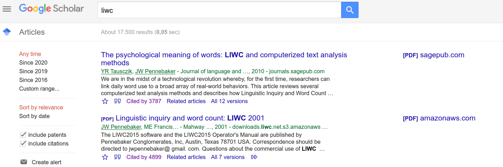

```{r xaringanExtra, echo = FALSE}
xaringanExtra::use_tile_view()
xaringanExtra::use_animate_all(params$animation)
xaringanExtra::use_logo(image_url = "img/mzes_logo.png", width = 280)
mzesalike::use_footer(params)
```


# The current state of text analysis in 3 slides: 1

```{r, echo = FALSE}

```

---

# The current state of text analysis in 3 slides: 2

```{r, echo = FALSE}

```

---

# The current state of text analysis in 3 slides: 3

.pull-left[

]

.pull-right[


.extrasmall[Chan et al. (2020). Four best practices for measuring news sentiment using ‘off-the-shelf’ dictionaries: a large-scale p-hacking experiment. Computational Communication Research (Accepted)]

]

---

# Solutions?

```{r, echo = FALSE}

```

.extrasmall[Grimmer, J., & Stewart, B. M. (2013). Text as data: The promise and pitfalls of automatic content analysis methods for political texts. Political analysis, 21(3), 267-297.]

---
class: inverse, middle, center

# But how?

---

# Before oolong

```{r, echo = FALSE}

```

---

# With oolong

```r
## install.packages("oolong")
require(oolong)
test <- create_oolong(input_corpus = trump2k,
                      construct = "positive")
test$do_gold_standard_test()
```

---


---


---


---

# What have we done after the grant?

.pull-left[
Support all topic model packages

Speedy coding

Online deployment (Experimental)

A JOSS paper (we passed both reviewers)
]

.pull-right[

]

---

# Problems

Open source doesn't mean more developers

£ can't buy time

---
class: hide-footer

# oolong

A Standardized way to validate your automated content analysis tools (dictionary, topic models)

```r
install.packages("oolong")
```

- `r fontawesome::fa("github")` [chainsawriot/oolong](https://github.com/chainsawriot/oolong)
